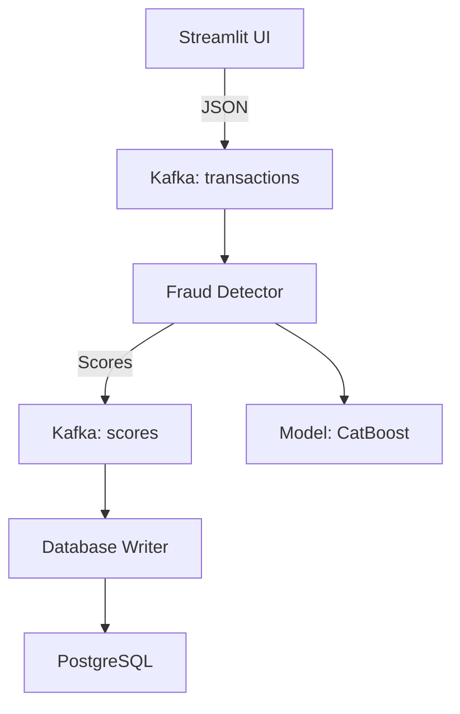

# MLOps Проект: Сервис Скоринга Транзакций на Apache Kafka

Этот проект демонстрирует продуктовое внедрение ML-модели для скоринга финансовых транзакций. Основная задача — трансформировать исходный сервис так, чтобы он обрабатывал транзакции, поступающие из **Apache Kafka**, а не из статичного файла. Решение полностью контейнеризовано с использованием Docker и Docker Compose.

Для запуска сервиса вам понадобится скачать предобученную модель и поместить ее в директорию `fraud_detector/model/catboost_model.cbm` , на диске так же находятся  файлы с транзакциями для теста:
https://drive.google.com/drive/folders/1D1dpfcPAHQvUd8FOuyAc4DyJ27TZMNlk?usp=sharing


## Обзор Проекта

Проект состоит из нескольких сервисов, оркестрированных с помощью Docker Compose:

  * **Zookeeper**: Сервер координации для Kafka.
  * **Kafka**: Брокер сообщений Apache Kafka, используется для приема и передачи потоков транзакций и результатов скоринга.
  * **kafka-setup**: Временный сервис, который инициализирует Kafka, создавая необходимые топики (`transactions` и `scores`).
  * **fraud\_detector**: Основной сервис скоринга. Читает сообщения из топика `transactions`, выполняет препроцессинг, применяет ML-модель для инференса на CPU и записывает результаты (скор и флаг фрода) в топик `scores`.
  * **database\_writer**: Дополнительный сервис. Читает сообщения из топика `scores` и сохраняет их в базу данных PostgreSQL.
  * **postgres**: База данных PostgreSQL для хранения результатов скоринга.
  * **interface**: Веб-интерфейс на Streamlit для отправки тестовых транзакций и просмотра результатов из PostgreSQL.
  * **kafka-ui**: Веб-интерфейс для мониторинга кластера Kafka, просмотра топиков и сообщений.

## Требования к Системе

  * **Docker Desktop** (включая Docker Engine и Docker Compose)
      * Убедитесь, что Docker Desktop запущен и работает.

## Структура Проекта

```
MLOPS_fraud_detector
├── fraud_detector/                  # Каталог сервиса скоринга
│   ├── app.py                       # Основной скрипт сервиса
│   ├── config.yaml                  # Конфигурация
│   ├── Dockerfile                   # Dockerfile для сборки образа
│   ├── requirements.txt             # Зависимости Python
│   ├── model/                       # Каталог с ML-моделью и её метаданными
│   │   ├── catboost_model.cbm
│   │   ├── threshold.json
│   │   └── categorical_features.json
│   └── src/                         # Исходный код логики
│       ├── data_processing.py
│       └── model_inference.py
├── database_writer/                 # Каталог сервиса записи в БД
│   ├── app.py
│   ├── init.sql                     # Скрипт инициализации БД
│   ├── Dockerfile
│   └── requirements.txt
├── interface/                       # Каталог веб-интерфейса
│   ├── app.py
│   ├── Dockerfile
│   ├── requirements.txt
│   └── .streamlit/
│       └── config.toml
├── .gitignore                       # Игнорируемые файлы
├── docker-compose.yaml              # Основной файл конфигурации Docker Compose
└── README.md                        # Этот файл
```


## Развертывание Проекта

### 1. Подготовка

Клонируйте репозиторий на ваш локальный компьютер:

```bash
git clone https://github.com/annashesta/MLOPS_Docker_Kafka_fraud_detection.git
cd MLOPS_Docker_Kafka_fraud_detectio
```

Скачайте модель и тестовые данные:
[Google Drive](https://drive.google.com/drive/folders/1D1dpfcPAHQvUd8FOuyAc4DyJ27TZMNlk?usp=sharing)

Поместите файk модели в папку:

fraud_detector/model/ → catboost_model.cbm


### Запуск Docker Compose

Перейдите в корневой каталог проекта (где находится `docker-compose.yaml`) и выполните команду:

```bash
docker-compose up --build -d
```

  * `--build`: Пересобирает образы контейнеров. Это полезно, если вы вносили изменения в код сервисов.
  * `-d`: Запускает контейнеры в фоновом режиме (detached mode).

Дождитесь, пока все контейнеры будут запущены и станут `Healthy` или `Started`. 

Вывод должен показать, что `zookeeper`, `kafka`, `postgres` имеют статус `healthy`, а остальные сервисы (`fraud_detector`, `database_writer`, `interface`, `kafka-ui`) - `running` или `started`. Сервис `kafka-setup` должен быть в состоянии `Exited` (он выполняет свою работу и завершается).


### Проверка сервисов
| Сервис | URL | Назначение |
|--------|-----|------------|
| Streamlit UI | http://localhost:8501 | Отправка транзакций |
| Kafka UI | http://localhost:8080 | Мониторинг сообщений |
| PostgreSQL | `psql -U user -d transactions_db` | Просмотр результатов |


## 🏗️ Архитектура системы



### Компоненты
1. **Data Producer** (Streamlit):
   - Web-интерфейс для загрузки CSV
   - Генерация transaction_id
   - Отправка в Kafka (1 сообщение = 1 транзакция)

2. **Fraud Detector**:
   - Препроцессинг (гео-расстояния, временные признаки)
   - Модель CatBoost (CPU inference)
   - Пороговая классификация

3. **Data Sink**:
   - Сохранение в PostgreSQL
   - Визуализация в Streamlit


-----

## Проверка Работоспособности (Зачет на 4)

### Доступ к Kafka UI

Откройте в браузере: `http://localhost:8080`

Вы должны увидеть интерфейс Kafka UI. Убедитесь, что кластер `local` доступен.

### Проверка топиков Kafka

1.  В Kafka UI перейдите в раздел **Topics**.
2.  Вы должны увидеть два топика: `transactions` и `scores`.
      * Если топиков нет, возможно, `kafka-setup` запустился до того, как Kafka был полностью готов.
        Попробуйте **перезапустить только Kafka UI** (иногда ему нужно больше времени на подключение):
        ```bash
        docker-compose restart kafka-ui
        ```
        Подождите 30 секунд - 1 минуту и обновите страницу Kafka UI.
      * Если топики по-прежнему не появились, выполните следующую команду, чтобы убедиться, что они созданы на самом брокере Kafka:
        ```bash
        docker-compose exec kafka kafka-topics.sh --bootstrap-server localhost:9092 --list
        ```
        В выводе должны быть `transactions` и `scores`. Если они там есть, но не в UI, то это точно проблема с UI (перезапуск должен помочь). 

### Отправка тестовых транзакций в Kafka

1.  Откройте в браузере интерфейс Streamlit: `http://localhost:8501`
2.  В этом интерфейсе вы найдете раздел для отправки транзакций.
3.  Загрузите файл test.csv  нажав `Browse files`
4.  Нажмите кнопку **"Отправить транзакции на обработку"** 
      * Каждая транзакция из `test.csv` будет отправлена как отдельное сообщение в топик `transactions`.
	-  Для теста представлен маленький (23 транзакции) и большой(262144 транзакции) файлы, по окончанию отправки появится ссобщение `Отправка завершена!`
5. Перейдите во вкладку `Результаты Скоринга` и нажав `Посмотреть результаты`.
   Так же отправке большого файла данных можно прервать в любой момент, перейдя во вкладку `Результаты Скоринга` и нажав `Посмотреть результаты`.


### Проверка сообщений в топике `scores`

1.  Вернитесь в Kafka UI (`http://localhost:8080`).
2.  Перейдите в раздел **Topics**, затем выберите топик `scores`.
3.  Перейдите во вкладку **Messages**.
4.  Вы должны увидеть сообщения, которые были опубликованы сервисом `fraud_detector`. Каждое сообщение должно содержать `transaction_id`, `score` и `fraud_flag`.
      * Если сообщений нет, проверьте логи сервиса `fraud_detector`:
        ```bash
        docker-compose logs fraud_detector
        ```
        Ищите ошибки, связанные с чтением из `transactions` или записью в `scores`, а также ошибки, связанные с моделью.

-----

## Дополнительные Требования (Зачет на 5)

### Проверка базы данных PostgreSQL

Вы можете подключиться к PostgreSQL для проверки схемы и данных.

1.  Получите имя запущенного контейнера PostgreSQL:
    ```bash
    docker ps | grep postgres
    ```
    Вывод будет выглядеть примерно так: `mlops_3-postgres-1`
2.  Зайдите в командную строку контейнера PostgreSQL:
    ```bash
    docker-compose exec postgres psql -U user -d transactions_db
    ```
    (Замените `user` и `transactions_db` на ваши реальные значения из `docker-compose.yaml`, если они отличаются).
3.  Внутри `psql` проверьте наличие таблицы `scores`:
    ```sql
    \dt
    ```
    Вы должны увидеть таблицу `scores`.
4.  Проверьте содержимое таблицы `scores`:
    ```sql
    SELECT * FROM scores LIMIT 5;
    ```
    Вы должны увидеть записи транзакций, включая `transaction_id`, `score` и `fraud_flag`.
5.  Выйдите из `psql`:
    ```sql
    \q
    ```

### Проверка сервиса `database_writer`

Убедитесь, что `database_writer` успешно читает из Kafka и пишет в PostgreSQL.

```bash
docker-compose logs database_writer
```

Вы должны увидеть сообщения об успешном сохранении записей в базу данных. Ищите строки типа `Successfully inserted transaction ... into PostgreSQL`.

### Проверка UI приложения

1.  Откройте или обновите веб-интерфейс Streamlit: `http://localhost:8501`.
2.  Перейдите в раздел, предназначенный для просмотра результатов (например, вкладка **"Результаты скоринга"** или аналогичное название, в зависимости от вашей реализации).
3.  Нажмите кнопку **"Посмотреть результаты"**.
4.  Вы должны увидеть:
      * 10 последних транзакций из PostgreSQL с `fraud_flag == 1`.
      * Гистограмму распределения скоров последних 100 транзакций.

-----

## Остановка Проекта

Чтобы остановить и удалить все контейнеры, сети и тома (кроме тех, которые явно определены как внешние):

```bash
docker-compose down
```

Если вы хотите удалить также тома с данными (например, для PostgreSQL или Kafka), что полезно при полной очистке и перезапуске:

```bash
docker-compose down -v
```

  * Используйте `-v` с осторожностью, так как это удалит все данные из PostgreSQL и Kafka\!


-----

## Решение Проблем

  * **Контейнер не запускается или `Exited` с ошибкой:**
    Проверьте логи конкретного контейнера:

    ```bash
    docker-compose logs <имя_сервиса>
    ```

    (например, `docker-compose logs fraud_detector`)
    Ищите сообщения об ошибках или трассировки стека.

  * **Kafka UI не показывает топики/сообщения:**

      * Как упоминалось выше, попробуйте перезапустить `kafka-ui`: `docker-compose restart kafka-ui`.
      * Убедитесь, что топики действительно созданы на брокере Kafka, как описано в разделе 

  * **Сообщения не проходят через Kafka (нет в топике `scores` или в базе данных):**

      * Проверьте логи `fraud_detector` на предмет ошибок при чтении/записи или применении модели.
      * Проверьте логи `database_writer` на предмет ошибок при чтении из `scores` или записи в PostgreSQL.
      * Убедитесь, что Kafka сам работает (`docker-compose ps` -\> `kafka` должен быть `healthy`).

  * **Проблемы с базой данных PostgreSQL:**

      * Проверьте логи `postgres`: `docker-compose logs postgres`.
      * Убедитесь, что сервис `postgres` `healthy` в `docker-compose ps`.
      * Проверьте скрипт `init.sql` на наличие ошибок.


# Real-Time Fraud Detection System

## DISCLAIMER
Сервис подготовлен в демонстрационных целях в рамках занятий МТС ШАД 2025 по MLOps. Датасеты предоставлены в рамках соревнования [Teta ML-1 2025](https://www.kaggle.com/competitions/teta-ml-1-2025). Система для обнаружения мошеннических транзакций в реальном времени с использованием ML-модели и Kafka для потоковой обработки данных.

## 🏗️ Архитектура
Компоненты системы:
1. **`interface`** (Streamlit UI):
   - Создан для удобной симуляции потоковых данных с транзакциями.
   - Имитирует отправку транзакций в Kafka через CSV-файлы.
   - Генерирует уникальные ID для транзакций.
   - Загружает транзакции отдельными сообщениями формата JSON в топик Kafka `transactions`.
2. **`fraud_detector`** (ML Service):
   - Загружает предобученную модель CatBoost (`catboost_model.cbm`).
   - Выполняет препроцессинг данных:
     - Извлечение временных признаков.
     - Расчет гео-расстояний.
     - Загрузка списка категориальных переменных.
   - Производит скоринг с загруженным порогом.
   - Выгружает результат скоринга в топик Kafka `scoring`.
3. **`database_writer`** (Database Writer):
   - Читает сообщения из топика Kafka `scoring`.
   - Записывает результаты скоринга в PostgreSQL базу данных.
4. **Kafka Infrastructure**:
   - **Zookeeper + Kafka брокер**:
     - Автоматическое создание топиков `transactions` и `scoring`.
   - **Kafka UI**:
     - Веб-интерфейс для мониторинга сообщений (порт 8080).
5. **PostgreSQL Database**:
   - Хранит результаты скоринга для дальнейшего анализа и отчетности.


## 🚀 Быстрый старт
### Требования
- Docker 20.10+
- Docker Compose 2.0+

### Запуск
```bash
git clone https://github.com/your-repo/fraud-detection-system.git
cd fraud-detection-system
# Сборка и запуск всех сервисов
docker-compose up --build
```
После запуска:
- **Streamlit UI**: [http://localhost:8501](http://localhost:8501)
- **Kafka UI**: [http://localhost:8080](http://localhost:8080)
- **Логи сервисов**:
  ```bash
  docker-compose logs <service_name>  # Например: fraud_detector, kafka, interface
  ```


## 🛠️ Использование
### 1. Загрузка данных:
 - Загрузите CSV через интерфейс Streamlit. Для тестирования работы проекта используется файл формата `test.csv` из соревнования [Teta ML-1 2025](https://www.kaggle.com/competitions/teta-ml-1-2025).
 - Пример структуры данных:
    ```csv
    transaction_time,amount,lat,lon,merchant_lat,merchant_lon,gender,...
    2023-01-01 12:30:00,150.50,40.7128,-74.0060,40.7580,-73.9855,M,...
    ```
 - Для первых тестов рекомендуется загружать небольшой семпл данных (до 100 транзакций) за раз, чтобы исполнение кода не заняло много времени.

### 2. Мониторинг:
 - **Kafka UI**: Просматривайте сообщения в топиках `transactions` и `scoring`.
 - **Логи обработки**: `/app/logs/service.log` внутри контейнера `fraud_detector`.

### 3. Результаты:
 - Скоринговые оценки пишутся в топик `scoring` в формате:
    ```json
    {
      "score": 0.995, 
      "fraud_flag": 1, 
      "transaction_id": "d6b0f7a0-8e1a-4a3c-9b2d-5c8f9d1e2f3a"
    }
    ```


## Настройки Kafka
```yaml
Топики:
- transactions (входные данные)
- scoring (результаты скоринга)
Репликация: 1 (для разработки)
Партиции: 3
```
*Примечание:* 
Для полной функциональности убедитесь, что:
1. Модель `catboost_model.cbm` размещена в `fraud_detector/model/`
3. Порты 8080, 8501 и 9092 свободны на хосте

