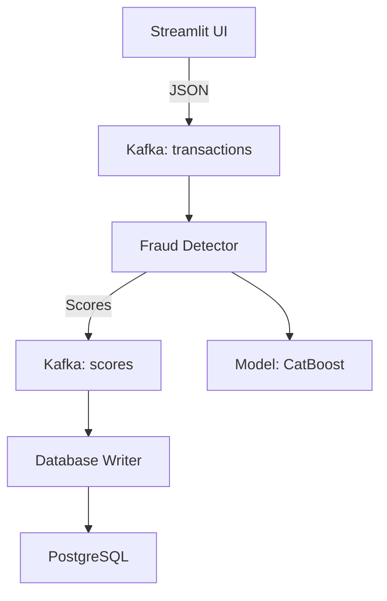

# MLOps Проект: Сервис Скоринга Транзакций на Apache Kafka

Этот проект демонстрирует продуктовое внедрение ML-модели для скоринга финансовых транзакций. Основная задача — трансформировать исходный сервис так, чтобы он обрабатывал транзакции, поступающие из **Apache Kafka**, а не из статичного файла. Решение полностью контейнеризовано с использованием Docker и Docker Compose.

 Датасеты предоставлены в рамках соревнования [Teta ML-1 2025](https://www.kaggle.com/competitions/teta-ml-1-2025). Система для обнаружения мошеннических транзакций в реальном времени с использованием ML-модели и Kafka для потоковой обработки данных.

Для запуска сервиса вам понадобится скачать предобученную модель и поместить ее в директорию `fraud_detector/model/catboost_model.cbm` , на диске так же находятся  файлы с транзакциями для теста:
https://drive.google.com/drive/folders/1D1dpfcPAHQvUd8FOuyAc4DyJ27TZMNlk?usp=sharing


## Обзор Проекта

Проект состоит из нескольких сервисов, оркестрированных с помощью Docker Compose:

  * **Zookeeper**: Сервер координации для Kafka.
  * **Kafka**: Брокер сообщений Apache Kafka, используется для приема и передачи потоков транзакций и результатов скоринга.
  * **kafka-setup**: Временный сервис, который инициализирует Kafka, создавая необходимые топики (`transactions` и `scores`).
  * **fraud\_detector**: Основной сервис скоринга. Читает сообщения из топика `transactions`, выполняет препроцессинг, применяет ML-модель для инференса на CPU и записывает результаты (скор и флаг фрода) в топик `scores`.
  * **database\_writer**: Дополнительный сервис. Читает сообщения из топика `scores` и сохраняет их в базу данных PostgreSQL.
  * **postgres**: База данных PostgreSQL для хранения результатов скоринга.
  * **interface**: Веб-интерфейс на Streamlit для отправки тестовых транзакций и просмотра результатов из PostgreSQL.
  * **kafka-ui**: Веб-интерфейс для мониторинга кластера Kafka, просмотра топиков и сообщений.

## Требования к Системе

  * **Docker Desktop** (включая Docker Engine и Docker Compose)
      * Убедитесь, что Docker Desktop запущен и работает.

## Структура Проекта

```
MLOPS_fraud_detector
├── fraud_detector/                  # Каталог сервиса скоринга
│   ├── app.py                       # Основной скрипт сервиса
│   ├── config.yaml                  # Конфигурация
│   ├── Dockerfile                   # Dockerfile для сборки образа
│   ├── requirements.txt             # Зависимости Python
│   ├── model/                       # Каталог с ML-моделью и её метаданными
│   │   ├── catboost_model.cbm
│   │   ├── threshold.json
│   │   └── categorical_features.json
│   └── src/                         # Исходный код логики
│       ├── data_processing.py
│       └── model_inference.py
├── database_writer/                 # Каталог сервиса записи в БД
│   ├── app.py
│   ├── init.sql                     # Скрипт инициализации БД
│   ├── Dockerfile
│   └── requirements.txt
├── interface/                       # Каталог веб-интерфейса
│   ├── app.py
│   ├── Dockerfile
│   ├── requirements.txt
│   └── .streamlit/
│       └── config.toml
├── .gitignore                       # Игнорируемые файлы
├── docker-compose.yaml              # Основной файл конфигурации Docker Compose
└── README.md                        # Этот файл
```

---


## 🏗️ Архитектура системы



### Компоненты
1. **Data Producer** (Streamlit):
   - Web-интерфейс для загрузки CSV
   - Генерация transaction_id
   - Отправка в Kafka (1 сообщение = 1 транзакция)

2. **Fraud Detector**:
   - Препроцессинг (гео-расстояния, временные признаки)
   - Модель CatBoost (CPU inference)
   - Пороговая классификация

3. **Data Sink**:
   - Сохранение в PostgreSQL
   - Визуализация в Streamlit

---


## 🚀 Быстрый старт
### Требования
- Docker 20.10+
- Docker Compose 2.0+

### Запуск
```bash
git clone https://github.com/annashesta/MLOPS_Docker_Kafka_fraud_detection.git
cd MLOPS_Docker_Kafka_fraud_detectio
```

Скачайте модель и тестовые данные:
[Google Drive](https://drive.google.com/drive/folders/1D1dpfcPAHQvUd8FOuyAc4DyJ27TZMNlk?usp=sharing)

Поместите файл модели в папку:

`fraud_detector/model/ → catboost_model.cbm`

# Сборка и запуск всех сервисов
```
docker-compose up --build -d
```


### Проверка сервисов
| Сервис | URL | Назначение |
|--------|-----|------------|
| Streamlit UI | http://localhost:8501 | Отправка транзакций |
| Kafka UI | http://localhost:8080 | Мониторинг сообщений |
| PostgreSQL | `psql -U user -d transactions_db` | Просмотр результатов |
| Логи сервисов | `docker-compose logs <service_name> ` | Например: fraud_detector, kafka, interfac |


## 🛠️ Использование
### 1. Загрузка данных:
 - Загрузите CSV через интерфейс Streamlit. Для тестирования работы проекта используется файл формата `test.csv` из соревнования [Teta ML-1 2025](https://www.kaggle.com/competitions/teta-ml-1-2025).
 - Пример структуры данных:
    ```csv
    transaction_time,amount,lat,lon,merchant_lat,merchant_lon,gender,...
    2023-01-01 12:30:00,150.50,40.7128,-74.0060,40.7580,-73.9855,M,...
    ```
-  Для теста на диске представлены файлы test.csv: маленький (23 транзакции) и большой(262144 транзакции)

### 2. Отправка данных:
1.  Откройте в браузере интерфейс Streamlit: `http://localhost:8501`
2.  В этом интерфейсе вы найдете раздел для отправки транзакций.
3.  Загрузите файл test.csv  нажав `Browse files`
4.  Нажмите кнопку **"Отправить транзакции на обработку"** 
   - Каждая транзакция из `test.csv` будет отправлена как отдельное сообщение в топик `transactions`.
	- По окончанию отправки появится ссобщение `Отправка завершена!`
   - При отправке большого файла данных, ее  можно прервать в любой момент, перейдя во вкладку `Результаты Скоринга` и посмотрев резултаты. 
5. Перейдите во вкладку `Результаты Скоринга` и нажмите `Посмотреть результаты`.


### 3. Мониторинг:
 - **Kafka UI**: Просматривайте сообщения в топиках `transactions` и `scoring`.
 - **Логи обработки**: `/app/logs/service.log` внутри контейнера `fraud_detector`.

### 3. Результаты:
 - Скоринговые оценки пишутся в топик `scoring` в формате:
    ```json
    {
      "score": 0.995, 
      "fraud_flag": 1, 
      "transaction_id": "d6b0f7a0-8e1a-4a3c-9b2d-5c8f9d1e2f3a"
    }
    ```


## Остановка Проекта

Чтобы остановить и удалить все контейнеры, сети и тома (кроме тех, которые явно определены как внешние):

```bash
docker-compose down
```

Если вы хотите удалить также тома с данными (например, для PostgreSQL или Kafka), что полезно при полной очистке и перезапуске:

```bash
docker-compose down -v
```

  * Используйте `-v` с осторожностью, так как это удалит все данные из PostgreSQL и Kafka\!


*Примечание:* 
Для полной функциональности убедитесь, что:
1. Модель `catboost_model.cbm` размещена в `fraud_detector/model/`
3. Порты 8080, 8501 и 9092 свободны на хосте


## Лицензия
MIT License © 2025 Anna Shestakova
